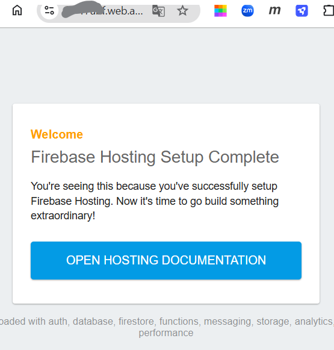

## FCM 이란?

Firebase Cloud Messaging의 약자로 구글에서 제공하는 메시징 서비스로,   
FCM은 서버에서 클라이언트로 안정적으로 메시지를 전달 할 수 있도록 도와주는 서비스입니다.

## 1. 구현 해보기

### 1.1 FCM 메시지 흐름


### 1.2 FCM 사용을 위한 서버의 조건

1. 서버는 FCM에서 지정한 형식의 메시지 요청을 보낼 수 있어야 합니다.
2. **지수 백오프**를 사용해 요청을 처리하고 다시 보낼 수 있어야 합니다.
    - [지수 백오프]: 요청이 실패할 때마다 다음 요청까지의 유휴시간 간격을 n배씩 늘리면서 재요청을 지연시키는 알고리즘
    - 임의 지연을 사용해 연쇄 충돌을 방지하기 위해서 사용
3. **서버 승인 사용자의 인증 정보**와 **클라이언트의 등록 토큰**을 안전하게 저장 할 수 있어야 합니다.
    - 서버 승인 사용자의 인증 정보: 메시지를 보낼 앱 서버가 인증된 서버라는 것을 증명하는 정보
    - 클라이언트의 등록 토큰: 메시지를 보내고자 하는 디바이스의 정보

### 1.3 워크플로우

1. 사용자가 앱을 실행하면, 앱은 FCM 메시지를 수신합니다.
2. 앱은 FCM 메시지를 처리하고, 사용자에게 알림을 표시합니다.
3. 사용자가 알림을 클릭하면, 앱은 알림에 대한 정보를 표시합니다.
4. 앱은 알림에 대한 정보를 서버로 전송합니다.
5. 서버는 알림에 대한 정보를 저장합니다.
6. 서버는 알림에 대한 정보를 사용자에게 전송합니다.
7. 사용자는 알림에 대한 정보를 확인합니다.
8. 사용자는 알림에 대한 정보를 삭제합니다.
9. 서버는 알림에 대한 정보를 삭제합니다.
10. 사용자는 앱을 종료합니다.
11. 앱은 종료됩니다.

## 2. 실습

### 2.1 Firebase 프로젝트 생성

### 2.2 Firebase Admin SDK 설정

[공식사이트](https://firebase.google.com/docs/admin/setup?hl=ko&_gl=1*68beem*_up*MQ..*_ga*MTk1MTk3OTE0Mi4xNzM4Mjg0MTYy*_ga_CW55HF8NVT*MTczODI4NDE2Mi4xLjAuMTczODI4NDE2Mi4wLjAuMA..)
를 참고하여 Firebase Admin SDK 설정을 진행합니다.

서버에서 FCM 메시지를 보내기 위한 Firebase Admin SDK 라이브러리 의존성을 추가해 줍니다.

``` groovy
dependencies {
  implementation 'com.google.firebase:firebase-admin:9.4.3'
}
```

SDK 초기화에 앞서 `서비스 계정의 비공개 키 파일(.json)`이 필요 합니다.   
[서비스 계정 생성](https://console.firebase.google.com/u/0/project/_/settings/serviceaccounts/adminsdk?hl=ko&_gl=1*62ca0n*_up*MQ..*_ga*ODM1ODkwNTYwLjE3MzgyODY4NTI.*_ga_CW55HF8NVT*MTczODI4Njg1Mi4xLjAuMTczODI4Njg1Mi4wLjAuMA..)
으로 접속 후 다음 절차를 따라 프로젝트 생성 후 비공개 키를 발급 받도록 합니다.

``` text
1. Firebase Console에서 설정 > 서비스 계정을 엽니다.
2. 새 비공개 키 생성을 클릭한 다음 키 생성을 클릭하여 확인합니다.
3. 키가 들어 있는 JSON 파일을 안전하게 저장합니다.
```

프로젝트를 생성하게 되면 친절하게 Admin SDK 초기화 코드를 제공해 줍니다.  
여기서 `새 비공개 키 생성` 버튼을 클릭하여 JSON 파일을 다운로드 받습니다. `키 파일`은 기밀 데이터이므로 공개저장소에 업로드 하지 않도록 주의합니다.   
.gitignore 파일에 `*.json` 을 추가하여 업로드 되지 않도록 설정합니다.


다운로드 받은 JSON 파일을 프로젝트의 `resources` 디렉토리에 저장 후 SDK 를 초기화 하기 위해 다음과 같이 코드를 작성합니다.

``` java
@Configuration
public class FcmConfig {
    @PostConstruct
    public void initialize() throws IOException {
        String keyPath = "fcm-key/firebase-adminsdk.json";  //resources 폴더에 넣어둔 key 경로

        InputStream serviceAccount = new ClassPathResource(keyPath).getInputStream();

        FirebaseOptions options = new FirebaseOptions.Builder()
                .setCredentials(GoogleCredentials.fromStream(serviceAccount))
                .build();

        FirebaseApp.initializeApp(options);
    }
}
```

### 2.3 서버에서 FCM 메시지 보내기
메시지를 전송하는 방법은 다음과 같으며, 스니펫은 링크를 참고하시길 바랍니다. 
- [특정 기기에 메시지 전송](https://firebase.google.com/docs/cloud-messaging/send-message?hl=ko#send-messages-to-specific-devices) - client의 token 기반으로 메시지를 발행 합니다.
- [여러 기기에 메시지 전송](https://firebase.google.com/docs/cloud-messaging/send-message?hl=ko#send-messages-to-multiple-devices) - client의 token 목록을 기반으로 메시지를 발행 합니다. 
- [주제(Topic)로 메시지 전송](https://firebase.google.com/docs/cloud-messaging/send-message?hl=ko#send-messages-to-topics) - topic 기반으로 메시지를 발행 합니다.
- [기기 그룹에 메시지 전송](https://firebase.google.com/docs/cloud-messaging/send-message?hl=ko#send-messages-to-device-groups)

메시지 필드는 플랫폼(Android, iOS, 웹)의 `공통 필드`와 `플랫폼별 필드` 가 있으며,    
플랫폼별 필드를 사용해 [플랫폼에 맞게 맞춤 설정](https://firebase.google.com/docs/cloud-messaging/send-message?hl=ko#customize-messages-across-platforms)이 가능 합니다.   
플랫폼별 블록에서 제공하는 키에 관한 자세한 내용은 [HTTP v1 참조 문서](https://firebase.google.com/docs/reference/fcm/rest/v1/projects.messages?hl=ko&_gl=1*1xmtpjp*_up*MQ..*_ga*NDM4NjI0MjY5LjE3MzgzODg2MTM.*_ga_CW55HF8NVT*MTczODM4ODYxMi4xLjAuMTczODM4ODYxMi4wLjAuMA..#resource:-message)에서 확인 하세요.

``` json
[ 공통 필드 ]
message.notification.title
message.notification.body
message.data
[ 플랫폼별 필드 ]
message.android   //안드로이드
message.webpush   //Web
message.apns      //Apple
```

서버에서 클라이언트의 Topic 구독과 취소를 관리 할 수 있으며, 주제(Topic) 메시지 전송을 사용 할 경우 유용하게 활용 할 수 있습니다.   
자세한 내용과 스니펫은 [서버 Topic 관리](https://firebase.google.com/docs/cloud-messaging/manage-topics?hl=ko&_gl=1*1kg8otd*_up*MQ..*_ga*MTA3NTAxODI2My4xNzM4Mzk3NTkw*_ga_CW55HF8NVT*MTczODM5NzU5MC4xLjAuMTczODM5NzU5MC4wLjAuMA..) 문서에서 확인 할 수 있습니다. 

### 2.4 클라이언트에서 FCM 메시지 수신하기

먼저 앱을 생성하기 위해 [계정 생성](https://console.firebase.google.com/u/0/project/_/settings/serviceaccounts/adminsdk?hl=ko&_gl=1*62ca0n*_up*MQ..*_ga*ODM1ODkwNTYwLjE3MzgyODY4NTI.*_ga_CW55HF8NVT*MTczODI4Njg1Mi4xLjAuMTczODI4Njg1Mi4wLjAuMA..) 에 접속해 프로젝트>일반 페이지에서 "앱 생성"을 진행 합니다.   
본 예제는 WebApp 으로 생성 했습니다.


앱 생성이 완료되면 다음과 같이 친절한 스니펫을 확인 할 수 있습니다.


이후 "Firebase 호스팅 사이트에 연결" 버튼을 클릭해 호스팅을 생성하도록 합니다.


다음 커맨드는 프로젝트 디렉터리를 생성할 **Root 경로에서 진행**하시길 권장 드립니다.    
프로젝트 생성 단계에서 나열되는 목록 중 **"( ) Hosting: Configure files for Firebase Hosting and (optionally) set up GitHub Action deploys
"** 를 선택 하도록 합니다.
```shell
1) Firebase CLI 설치
  $ npm install -g firebase-tools
2) 프로젝트 초기화
  $ firebase login  //로그인. 웹브라우저에서 구글 계정으로 로그인이 진행 됩니다.
  $ firebase init   //프로젝트 생성. 
3) 호이스팅에 배포
  $ firebase deploy //나열되는 프로젝트 목록 중 배포할 프로젝트를 선택 합니다.
``` 
배포까지 성공하면 다음 링크를 통해 배포된 페이지를 확인 할 수 있습니다.
 


### 2.5 클라이언트에서 FCM 메시지 응답하기

### 2.6 클라이언트에서 FCM 메시지 삭제하기

### 2.7 클라이언트에서 FCM 메시지 확인하기

### 2.8 서버에서 FCM 메시지 삭제하기

### 2.9 서버에서 FCM 메시지 확인하기

### 2.10 서버에서 FCM 메시지 전송하기

### 2.11 서버에서 FCM 메시지 전송 결과 확인하기

### 2.12 서버에서 FCM 메시지 전송 결과 처리하기

### 2.13 서버에서 FCM 메시지 전송 결과 저장하기

### 2.14 서버에서 FCM 메시지 전송 결과 삭제하기

## 99. 참고 자료

### 99.1 사이트

- [Firebase Cloud Messaging 공식문서](https://firebase.google.com/docs/cloud-messaging)
- [FCM 알아보기](https://musma.github.io/2023/09/06/FCM-%EC%95%8C%EC%95%84%EB%B3%B4%EA%B8%B0.html#fcm-%EC%9D%B4%EB%9E%80)